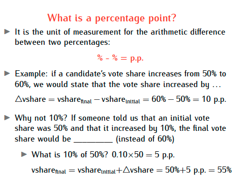
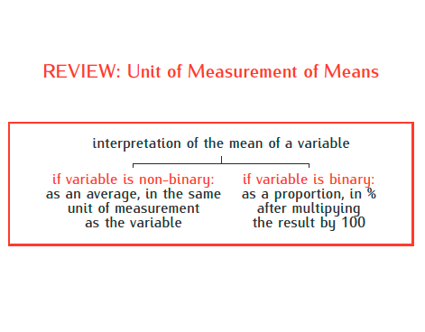
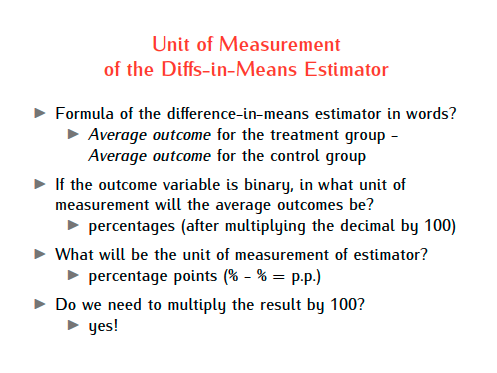
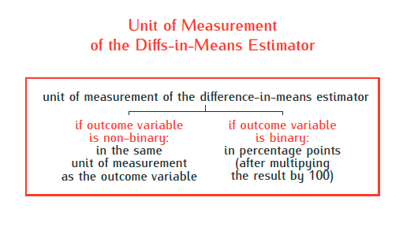
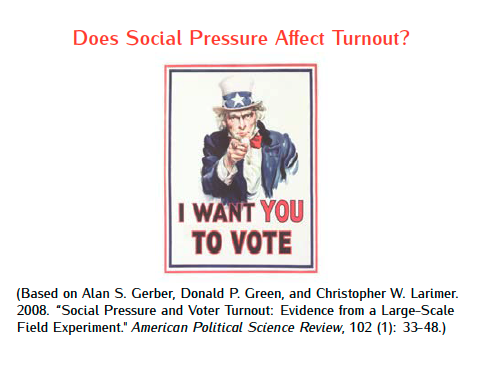
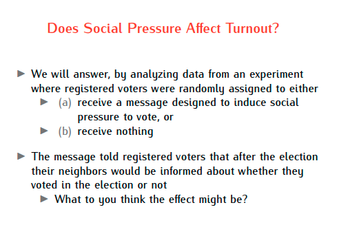
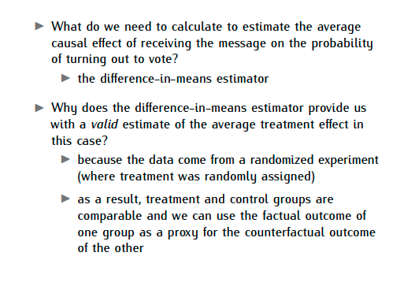
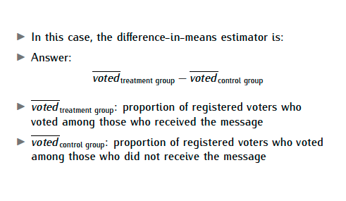
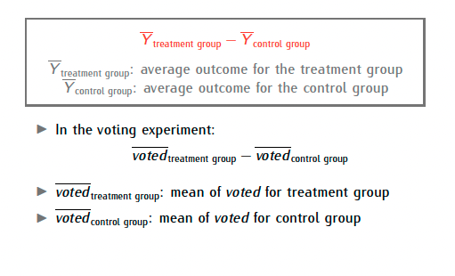

```{r setup, include=FALSE}
knitr::opts_chunk$set(echo = TRUE) # chunks show code unless you say otherwise

p_needed <- c(# all packages you need to install here
  "knitr",
 # "ggplot2",
 # "stargazer",
 "bsplus",
 "htmltools",
  "haven", 
   "MASS",
  "dplyr" 
  ) 

# installs only the required packages 
lapply(p_needed[!(p_needed %in% rownames(installed.packages()))], install.packages)
lapply(p_needed, library, character.only = TRUE)

if (!"summarytools" %in% rownames(installed.packages())){
  remotes::install_github("dcomtois/summarytools", upgrade = "never", dependencies = TRUE)
}

set.seed(2025)
```


## Plan for today


### What is a percentage point? 



### REVIEW: Unit of Measurement of Means {.tabset}








### Does Social Pressure Affect Turnout?{.tabset}





#### What do we need to calculate?


#### difference-in-means






### Randomized experiments {.tabset}

#### Why randomization works?

```{r random plots, echo=FALSE, fig.width=12, fig.height=4, dev='png'}
set.seed(123)

one_run_stats <- function(N, p) {
  if (N %% 2 == 1) N <- N + 1
  n1 <- round(N * p)
  genders <- c(rep(1, n1), rep(0, N - n1))
  idx <- sample.int(N)
  A <- genders[idx[1:(N/2)]]
  B <- genders[idx[(N/2 + 1):N]]
  c(diff = mean(A) - mean(B), propA = mean(A), propB = mean(B))
}

simulate_and_plot <- function(N, p, R, main_label) {
  res <- replicate(R, one_run_stats(N, p))
  diffs <- res["diff", ]
  propA <- res["propA", ]
  propB <- res["propB", ]

  # draw without a main title
  hist(diffs, breaks = 20,
       main = "",  # leave blank
       xlab = "Difference in proportions (M − F)",
       col = "grey85", border = "white")
  abline(v = 0, lty = 2)

  # add the plot title closer to the plot
  title(main = main_label, line = 0.2, cex.main = 1.1)

  # push the header higher so it doesn't collide with the title
  mtext(sprintf("N = %d | R = %d | p = %.2f",
                ifelse(N %% 2 == 0, N, N + 1), R, p),
        side = 3, line = 2.6, cex = 0.9, adj = 0)

  # footer stays the same
  footer1 <- sprintf("Mean diff = %+0.3f | Mean |diff| = %0.3f", mean(diffs), mean(abs(diffs)))
  footer2 <- sprintf("mean prop(Male) = %0.3f | mean prop(Female) = %0.3f", mean(propA), mean(propB))
  mtext(footer1, side = 1, line = 4.5, cex = 0.85)
  mtext(footer2, side = 1, line = 6.2, cex = 0.85)
}

# --- Scenarios ---
N_base <- 100
R_base <- 100
scenarios <- list(
  list(N = N_base, p = 0.50, R = R_base, label = "Balanced population"),
  list(N = N_base, p = 0.10, R = R_base, label = "10% is Male"),
  list(N = N_base, p = 0.90, R = R_base, label = "90% is Male")
)

# a bit more top margin for header + title breathing room
op <- par(mfrow = c(1, 3), mar = c(8, 4, 7, 1) + 0.2)
#on.exit(par(op), add = TRUE)

for (sc in scenarios) simulate_and_plot(sc$N, sc$p, sc$R, sc$label)
```

